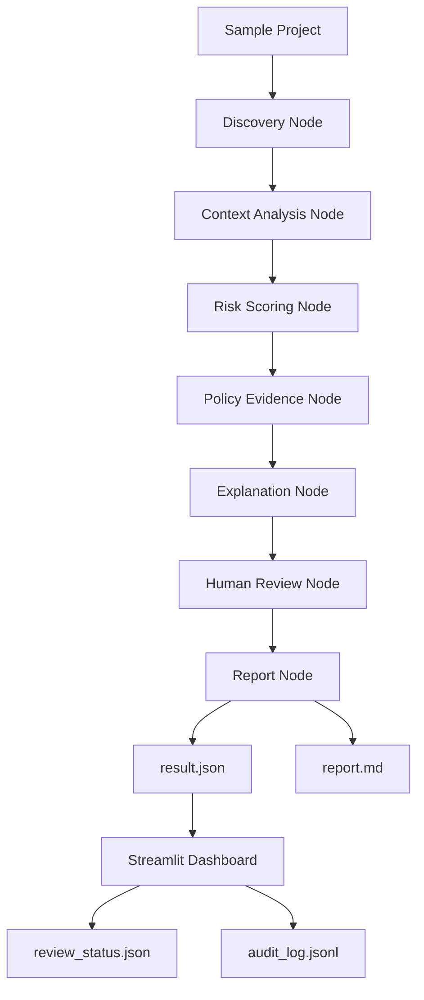

# NHI Secret Agent

LangGraph 기반 NHI Secret 위험 분석 및 관리자 검토 리포팅 시스템.

## Overview

NHI Secret Agent는 소스코드, 설정 파일, 로그에 노출될 수 있는 Secret 후보를 탐지하고, 위험도 분석, 정책 근거 검색, 관리자 검토, 감사 로그까지 연결하는 보안 운영형 MVP입니다.

NHI, 즉 Non-Human Identity는 CI/CD, 서비스 계정, 자동화 봇, 클라우드 애플리케이션처럼 사람이 직접 로그인하지 않지만 시스템 접근 권한을 가지는 비인간 주체를 의미합니다.

이 프로젝트는 Secret 탐지를 단순 문자열 탐지로 끝내지 않고, 보안 담당자가 실제로 검토할 수 있는 리포트와 대시보드로 연결하는 것을 목표로 합니다.

## Features

- 로컬 샘플 폴더 기반 Secret 후보 탐지
- Secret 원문 미저장 및 마스킹 처리
- 파일 경로와 유형 기반 문맥 분석
- 위험도 점수화 및 Critical / High / Medium / Low 등급 분류
- keyword 기반 RAG-lite 정책 근거 검색
- LangGraph 기반 Node Workflow
- 규칙 기반 Explanation Agent
- Critical / High 항목 Human Review Queue 분류
- Review 결정 상태 저장
- Audit Log JSONL 기록
- JSON / Markdown 리포트 생성
- Streamlit 관리자 대시보드
- pytest 기반 보안성 검증
- Ruff 기반 코드 품질 검증
- Quality Gate 스크립트
- GitHub Actions CI

## Architecture



## Project Structure

```text
app/
├── main.py
├── agents/
│   ├── state.py
│   ├── graph.py
│   └── nodes/
├── scanner/
├── policy/
└── review/

frontend/
└── streamlit_app.py

scripts/
├── create_sample_project.py
└── quality_gate.py

data/
├── policies/
└── sample_project/

docs/
tests/
reports/
```

## Installation

```bash
python -m venv .venv
```

Windows PowerShell:

```bash
.\.venv\Scripts\activate
```

Install dependencies:

```bash
pip install -r requirements.txt
```

## Create Sample Project

보안상 샘플 Secret 파일은 Git에 직접 저장하지 않습니다.  
아래 명령어로 로컬 샘플 프로젝트를 생성합니다.

```bash
python scripts/create_sample_project.py
```

## Run Agent

```bash
python -m app.main --target-path data/sample_project
```

Expected outputs:

```text
reports/result.json
reports/report.md
```

Expected terminal summary:

```text
Raw Findings: 4
Context Results: 4
Risk Results: 4
Policy Evidence: 4
Explanations: 4
Review Results: 4
Errors: 0
```

## Run Dashboard

```bash
streamlit run frontend/streamlit_app.py
```

Dashboard tabs:

```text
Finding Overview
Finding Detail
Review Workflow
Policy Evidence
Audit Log
Raw JSON
```

## Human Review

Critical / High 항목은 자동 조치하지 않고 Human Review 대상으로 분류합니다.

지원하는 Review 상태:

```text
WAITING_HUMAN_REVIEW
APPROVED_ROTATION
FALSE_POSITIVE
ACCEPTED_RISK
RESOLVED
REVIEW_NOT_REQUIRED
```

Review 결정은 아래 파일에 저장됩니다.

```text
reports/review_status.json
reports/audit_log.jsonl
```

실제 Secret 폐기, 권한 회수, 외부 API 호출은 수행하지 않습니다.

## Security Principles

- Secret 원문을 저장하지 않습니다.
- 리포트에는 마스킹된 Secret만 포함합니다.
- 외부 LLM API로 Secret 정보를 전송하지 않습니다.
- 실제 Secret 유효성 검증을 수행하지 않습니다.
- 실제 권한 회수나 Secret 폐기를 수행하지 않습니다.
- Critical / High 항목은 Human Review 대상으로 분류합니다.
- Review 결정은 Audit Log로 기록합니다.
- 실행 결과 파일은 Git에 저장하지 않습니다.

## Test

```bash
python -m pytest -q
```

## Lint & Format

```bash
python -m ruff format app tests scripts frontend
python -m ruff check app tests scripts frontend
```

## Quality Gate

공개 저장소에 올리기 전 아래 명령어로 전체 품질 검사를 수행합니다.

```bash
python scripts/quality_gate.py
```

Quality Gate checks:

```text
필수 파일 존재 여부
data/sample_project Git 추적 상태
reports 실행 결과 파일 Git 추적 여부
raw-looking Secret 문자열 잔존 여부
생성된 리포트 내 Secret 원문 포함 여부
pytest 통과 여부
Ruff 통과 여부
```

## Documentation

```text
docs/architecture.md
docs/demo_checklist.md
docs/release_checklist.md
docs/portfolio_summary.md
docs/portfolio_project_page.md
docs/interview_script.md
docs/report_section.md
docs/screenshot_guide.md
```

## Current Limitations

- 실제 GitHub / AWS / Slack API와 연동하지 않습니다.
- 실제 Secret 유효성 검증을 수행하지 않습니다.
- 실제 권한 회수나 Secret 폐기를 수행하지 않습니다.
- 정책 검색은 keyword 기반 RAG-lite 방식입니다.
- Review 상태는 로컬 JSON 파일 기반입니다.

## Future Work

- GitHub Repository Clone 기반 스캔
- AWS IAM 권한 범위 분석
- NetworkX 기반 Blast Radius 분석
- 벡터DB 기반 정책 RAG
- 티켓 시스템 연동
- 조직 승인 워크플로 연동
- CI/CD Secret Scan 연동