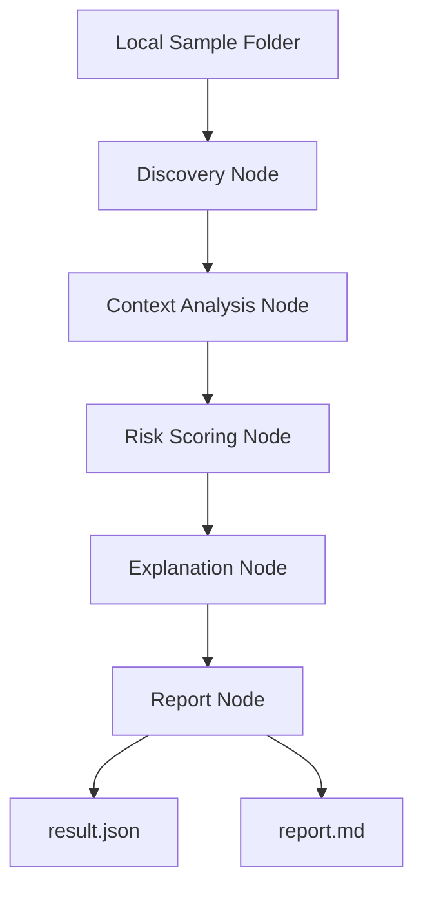

# NHI Secret Agent

LangGraph 기반 NHI Secret 위험 분석 및 리포팅 Agent MVP.

## 1. 프로젝트 개요

이 프로젝트는 소스코드, 설정 파일, 문서, 로그에 노출될 수 있는 NHI Secret 후보를 탐지하고,
문맥 분석, 위험도 점수화, Agent 설명 생성, JSON/Markdown 리포트 생성을 수행하는 보안 Agent MVP입니다.

NHI, 즉 Non-Human Identity는 CI/CD, 서비스 계정, 자동화 봇, 클라우드 애플리케이션처럼
사람이 직접 로그인하지 않지만 시스템 접근 권한을 가지는 비인간 주체를 의미합니다.

이 프로젝트는 Secret을 단순히 탐지하는 데서 끝나지 않고,
해당 Secret이 어떤 NHI 권한 위험으로 이어질 수 있는지 설명하고,
관리자 검토 가능한 리포트로 남기는 것을 목표로 합니다.

## 2. 현재 구현 단계

## 2. 현재 구현 단계

6단계: Policy Evidence + Streamlit Dashboard 추가

현재 구현된 기능은 다음과 같습니다.

- 로컬 샘플 폴더 기반 Secret 후보 탐지
- Secret 원문 미저장 및 마스킹 처리
- 파일 경로와 유형 기반 문맥 분석
- TypeRisk, ExposureRisk, ContextBonus, FileCriticalityBonus 기반 위험도 계산
- keyword 기반 RAG-lite 정책 근거 검색
- LangGraph 기반 Node Workflow 구성
- 규칙 기반 Explanation Agent
- JSON 결과 생성
- Markdown 리포트 생성
- Streamlit 관리자 대시보드 제공
- pytest 기반 보안성 검증
- 공개 저장소용 샘플 프로젝트 생성 스크립트 제공

## 3. 시스템 구조



## 4. 주요 폴더 구조

```text
app/
├── main.py
├── agents/
│   ├── state.py
│   ├── graph.py
│   └── nodes/
│       ├── discovery_node.py
│       ├── context_node.py
│       ├── risk_node.py
│       ├── explanation_node.py
│       └── report_node.py
├── scanner/
│   ├── masking.py
│   └── secret_scanner.py
└── report/

scripts/
└── create_sample_project.py

tests/
├── sample_data_factory.py
├── test_masking.py
├── test_secret_scanner.py
└── test_graph_run.py

reports/
├── result.json
└── report.md
```

## 5. 설치 방법

```bash
python -m venv .venv
```

Windows PowerShell:

```bash
.\.venv\Scripts\activate
```

패키지 설치:

```bash
pip install -r requirements.txt
```

## 6. 샘플 프로젝트 생성

보안상 `data/sample_project` 안의 샘플 Secret 파일은 Git에 직접 저장하지 않습니다.
아래 명령어로 로컬에 데모용 샘플 파일을 생성합니다.

```bash
python scripts/create_sample_project.py
```

생성되는 샘플 파일:

```text
data/sample_project/
├── .env
├── app.py
├── config.yml
├── server.log
└── README.md
```

모든 Secret 값은 실제 키가 아닌 테스트용 가짜 값입니다.

## 7. 실행 방법

```bash
python -m app.main --target-path data/sample_project
```

실행 결과:

```text
reports/result.json
reports/report.md
```

## 대시보드 실행 방법

먼저 샘플 프로젝트를 생성하고 Agent를 실행합니다.

```bash
python scripts/create_sample_project.py
python -m app.main --target-path data/sample_project
```

그다음 Streamlit 대시보드를 실행합니다.

```bash
streamlit run frontend/streamlit_app.py
```

## 8. 테스트 방법

```bash
python -m pytest -q
```

코드 포맷 및 정적 검사:

```bash
python -m ruff format app tests scripts
python -m ruff check app tests scripts
```

## 9. 보안 설계 원칙

- 실제 Secret은 사용하지 않습니다.
- 탐지 결과에는 Secret 원문을 저장하지 않습니다.
- 리포트에는 마스킹된 Secret만 포함합니다.
- Critical/High 등급은 자동 조치하지 않고 Human Review 대상으로 분류합니다.
- 실제 Secret 유효성 검증, 폐기, 권한 회수는 수행하지 않습니다.
- 로컬 샘플 파일은 스크립트로 생성하고 Git에는 직접 저장하지 않습니다.

## 10. 현재 한계

- 실제 GitHub, AWS, Slack, Google Drive API와 연동하지 않습니다.
- 실제 Secret 유효성 검증은 수행하지 않습니다.
- 실제 NHI 권한 범위 분석은 아직 더미 수준입니다.
- 정책 문서 RAG와 Streamlit 대시보드는 향후 확장 범위입니다.

## 11. 향후 확장 방향

- GitHub 저장소 clone 후 Secret Scan
- 정책 문서 RAG 기반 대응 권고
- NetworkX 기반 Blast Radius 분석
- Streamlit 기반 관리자 대시보드
- Human Approval 상태 관리
- Audit Log 저장
- CI/CD pre-commit Secret Scan 연동